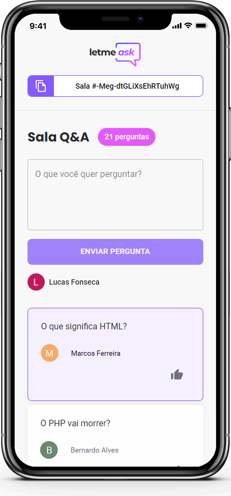

<h1 align="center">
  
</h1>

  

## About

Letmeask is an app for streamers to interact with their audience. Sign in with a Google Account, create a room and share your code to receive questions.

## Features

<strong>In this app, you can:</strong>

| Feature                                  | Room Admin | Any User |
| ---------------------------------------- | :--------: | :------: |
| Create a room to receive questions       |     X      |    X     |
| Close the room                           |     X      |          |
| Highlight the question you are answering |     X      |          |
| Delete questions if you want             |     X      |          |
| Send questions                           |            |    X     |
| Like/unlike questions                    |            |    X     |
| Share the room code                      |     X      |    X     |

## Responsive layout

  

This project is fully compatible with mobile devices of any size.

## Technologies

This project was devolved with the following technologies:

- HTML
- SCSS
- TypeScript
- ReactJS
- Firebase

---

<strong>The original project was designed by [Rocketseat](https://rocketseat.com.br) team for the ReactJS path at the NLW#Together event.</strong>\
\
By [Lucas Fonseca](https://github.com/LucasOFonseca)
